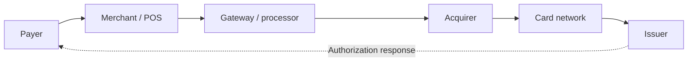

<p align="center"></p>

<p align="center">
  <a href="https://usf-fintech-algorithms.vercel.app"></a>
  <a href="https://usf-payment-rails.vercel.app"></a>
  <a href="https://github.com/adnanmasood/fintech-samples/actions"></a>
</p>

# USF AI in FinTech — Sample Projects

Instructor-created sample projects used in the **Fintech for AI course at the University of South Florida (USF)**, prepared independently by **Adnan Masood, PhD.** These examples connect financial decisions with algorithms, working software, verification, and clear explanations.

This is an independent teaching repository, not an official University of South Florida repository. The published reference projects contain fictional examples and course content, with no student records or individual assignment packets.

## Explore the projects

| Project | What you can learn | Live website | Code & instructions |
|---|---|---|---|
| **Fintech Algorithms** | Twelve AI algorithms, evaluation measures, guided exercises, interactive visuals, browser Python, and editable notebooks | [Open the learning app](https://usf-fintech-algorithms.vercel.app) | [Source & quick start](fintech-algorithms/) |
| **Project 0: Payment Rails Live** | Six payment participants and the path from authorization to merchant settlement | [Open the project guide](https://usf-payment-rails.vercel.app) | [Python reference & guide](project-0-payment-rails/) |

**Fintech Algorithms** is a static Astro/Svelte application. It covers logistic regression, trees and forests, gradient boosting, time series, clustering, anomaly detection, graph methods, transformers, retrieval-augmented generation, optimization, reinforcement learning, and Monte Carlo simulation. Its teaching activities combine numerical work, model selection, financial consequences, and limitations.

Learner progress stays in browser storage. Ordinary visits load the pages and tools you use. Choose **Make available offline** to download the complete course; the control shows the size and progress, supports retry and updates, and allows removal while preserving learning progress.

**Payment Rails Live** is a Python reference implementation with six participant processes and a browser dashboard. The hosted static guide explains the project and provides PDF guides, diagrams, reviewed screenshots, and a complete source download. Run the simulator on your own computer to interact with its messages and fictional balances.



Authorization reserves funds; capture records the merchant's collection instruction; clearing posts the payer debit and the obligation due to the merchant; settlement credits the merchant. These are simplified teaching conventions. The simulator uses fictional funds and tokens, with in-memory state that resets when the session stops.

## Run locally

### Fintech Algorithms

Use **Node 24** and **pnpm 11.25.0**. From a clone of this repository:

```sh
cd fintech-algorithms
corepack enable
pnpm install --frozen-lockfile
pnpm dev
```

For the production app, including search and offline preparation:

```sh
pnpm build
python3 start.py
```

Open **http://localhost:8000**. Python 3.9 or newer runs the built app; Windows users can use `py -3 start.py`. The repository contains source, so build it before using this launcher. See the [application README](fintech-algorithms/README.md) for notebooks, tests, and offline packaging.

### Payment Rails

Use **Python 3.9 or newer**; the simulator has no external Python runtime dependencies.

```sh
cd project-0-payment-rails
python3 start.py
```

On Windows, use `py -3 start.py`. Open **http://127.0.0.1:8010** and keep the terminal running. Ctrl+C stops the simulator and its six participants. See the [project README](project-0-payment-rails/README.md) for Docker, guided demonstrations, tests, and limitations.

## Submit your individual project

Submit through a **fork and pull request**. You do not need write access to this repository. Your project belongs under:

```text
student-projects/<project-slug>-<random-id>/
```

For example, `student-projects/digital-wallet-7f3c2a/`. Use a short descriptive slug and a random suffix; keep student names, student IDs, grades, and contact details out of folder names and submitted files.

Include your working source, fictional examples, tests for normal and failure cases, setup/run/test instructions, two screenshots, limitations, and `AI_USAGE.md` describing assistance and your verification. Explain one business rule and a small change you made and tested. Follow your assigned project brief for any additional requirements; this repository does not set deadlines or grading policy.

Start with the [submission instructions](CONTRIBUTING.md) and [project README template](docs/PROJECT_README_TEMPLATE.md). The pull request must target **`adnanmasood/fintech-samples` → `main`**.

### Use Claude Code to prepare the submission

Open Claude Code in your fork's local clone and use the following prompt, replacing the folder path with your chosen project folder:

```text
Read CONTRIBUTING.md and docs/PROJECT_README_TEMPLATE.md. Help me prepare
my individual project in student-projects/digital-wallet-7f3c2a/.
Use fictional data. Include source, normal/failure tests, run instructions,
screenshots, limitations, and AI_USAGE.md. Change only my project folder.
Run the documented checks and record actual results. Inspect files,
notebook outputs, screenshots, and the staged diff for personal data,
credentials, private paths, and generated dependencies. Fix issues and
show me the final diff before committing.
```

After reviewing the result:

```text
Commit only my project folder, push this branch to my fork, and create
a pull request to adnanmasood/fintech-samples, base main. Use the PR
template, explain the financial use case, list the checks actually run,
and include the limitations and AI-use record. Do not put my name,
student ID, grades, or contact information in the PR text.
```

Claude Code can help create a PR through GitHub CLI. Review the code and generated description yourself. See the [official Claude Code PR workflow](https://code.claude.com/docs/en/common-workflows#create-pull-requests).

**Public submission privacy:** GitHub usernames, profiles, PR activity, and commit authorship are publicly visible. File cleanup does not make a public submission anonymous. Enable [GitHub email privacy](https://docs.github.com/en/account-and-profile/how-tos/email-preferences/setting-your-commit-email-address) and use the GitHub-provided noreply address for commits. Discuss a different submission route with the instructor if public account attribution is unsuitable.

## Repository map

| Location | Purpose |
|---|---|
| `fintech-algorithms/` | Learning website, teaching data, scientific browser runtime, notebooks, and tests |
| `project-0-payment-rails/` | Local Python simulator, fictional scenarios, guides, diagrams, and static project website |
| `student-projects/` | Individual project contributions submitted through reviewed PRs |
| `docs/` | Submission template, banner, and release verification |
| `scripts/` | Publication hygiene checks |
| `.github/` | CI and pull request template |

## Verification and publishing

Repository CI validates teaching content, types, unit and browser behavior, offline functionality, notebook execution, the payment simulator, and publication hygiene. [Release verification](docs/RELEASE_VERIFICATION.md) records the checks performed for this release.

Both instructor reference websites are published on Vercel. Browser Python and notebooks run on the learner's device; the Payment Rails simulator runs locally. The hosted guide does not run a payment backend or collect student accounts or grades.

Vercel releases use the [instructor-only export](scripts/export-vercel-source.py) from a verified Git commit. The export admits only the two reference application directories and required licensing/configuration, so student submissions anywhere else in the repository are excluded. The latest deployed application commit and verification results are recorded in [release verification](docs/RELEASE_VERIFICATION.md).

## Rights and attribution

The repository's existing [Apache License 2.0](LICENSE) is preserved. The Fintech Algorithms teaching/reference material retains its existing **[CC BY-NC-SA 4.0](https://creativecommons.org/licenses/by-nc-sa/4.0/)** notice. Third-party software keeps its own licenses; see [third-party notices](fintech-algorithms/THIRD_PARTY_NOTICES.md) and bundled license files. These components are not relicensed by this publication.
